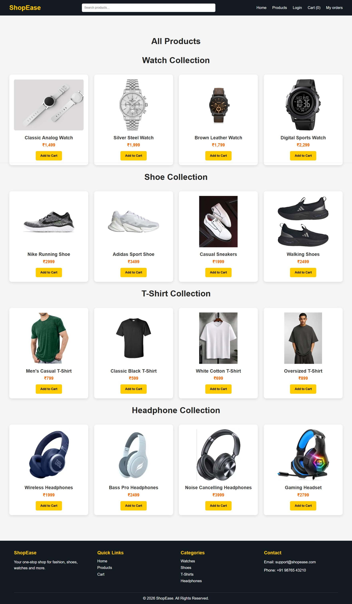
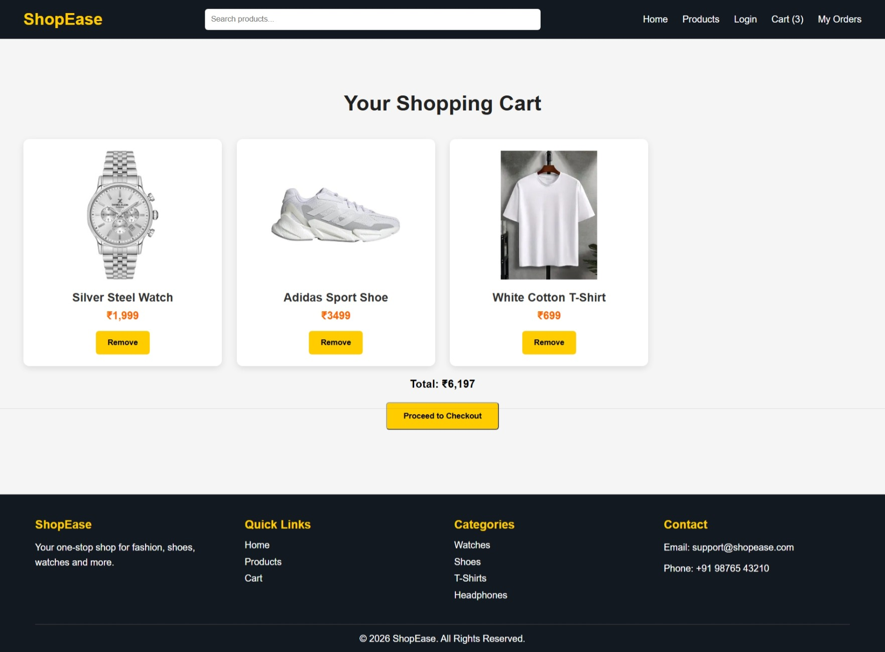
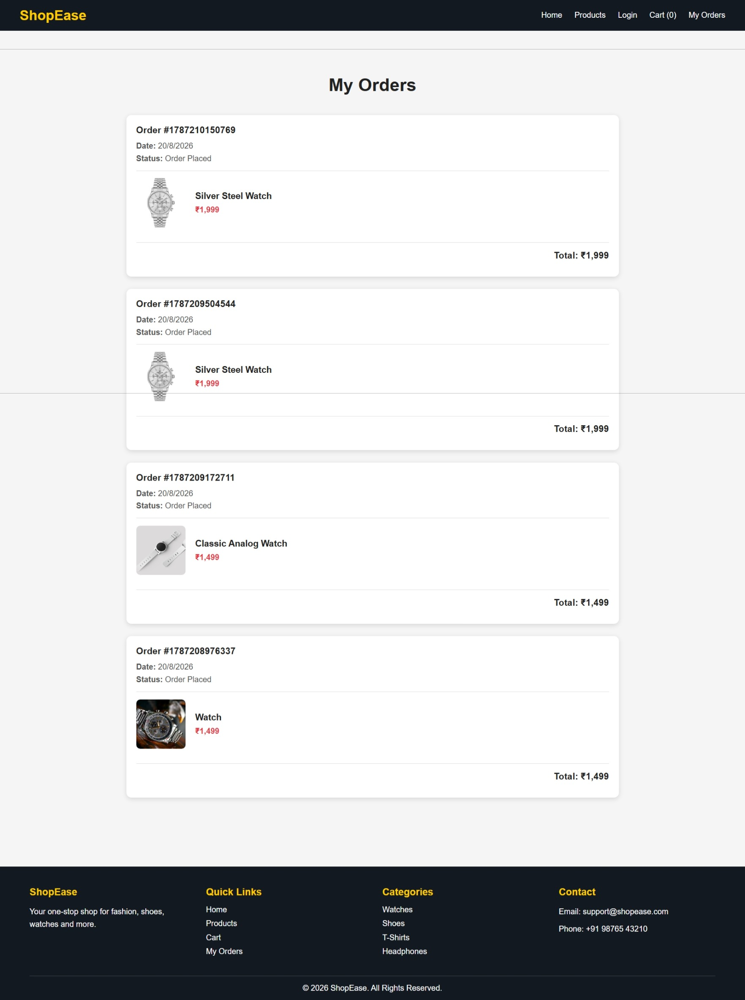

# ShopEsay - E-Commerce Website

A responsive E-Commerce website built using HTML, CSS, and JavaScript. The project provides a simple online shopping experience with product browsing, cart management, login, and order tracking.

## 🚀 Live Demo

https://kishan15034.github.io/ShopEsay/

## ✨ Features

* 🏠 Responsive Home Page
* 🛍️ Products Listing
* 🛒 Add to Cart functionality
* 🔢 Dynamic Cart Count
* 🔐 Login Page
* 📦 My Orders Page
* 💾 Local Storage for Cart and Orders
* 📱 Responsive Design
* 🎨 Clean and User-Friendly UI

## 🛠️ Technologies Used

* HTML5
* CSS3
* JavaScript
* Local Storage
* Git & GitHub
* GitHub Pages

## 📂 Project Structure

* `index.html` - Home page
* `products.html` - Products page
* `cart.html` - Shopping cart
* `login.html` - Login page
* `orders.html` - My Orders page
* `*.css` - Styling files
* `*.js` - JavaScript functionality

## 🎯 Project Purpose

This project was created to practice frontend web development concepts including HTML structure, CSS styling, JavaScript functionality, DOM manipulation, and Local Storage.

## 🔮 Future Improvements

* Add backend integration
* Add MongoDB database
* Add real user authentication
* Add payment gateway
* Add product search and filtering
* Add product details page

* ## 📸 Screenshots

### 🏠 Home Page

### 🛍️ Products Page

### 🛒 Cart Page

### 📦 My Orders Page

## 👨‍💻 Developer

Sandeep Maurya

Frontend Developer | HTML | CSS | JavaScript 
